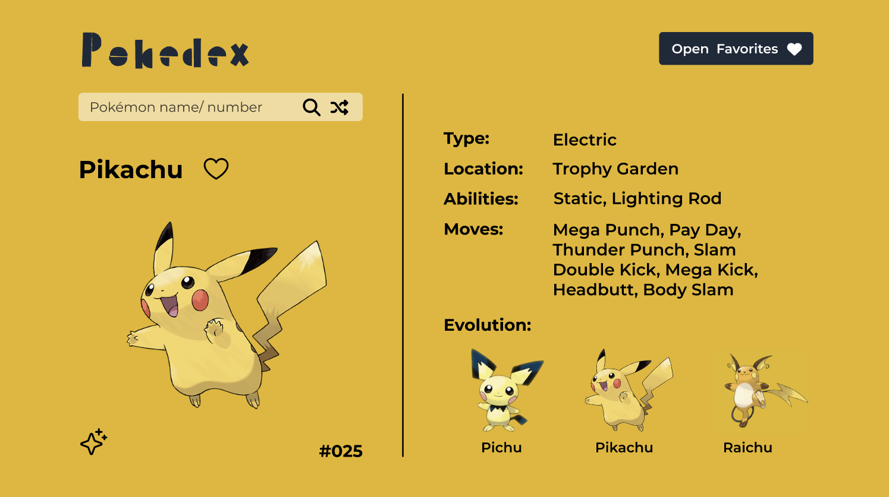

# Pokédex

**Name:** Elizabeth Trotter

**Project Scope:** This project is a single page Pokémon application that fetches data from [PokéAPI](https://pokeapi.co/). The design was prototyped in `Figma` for Desktop, Tablet, and Mobile and the site was made fully responsive with `Tailwind CSS`. 

Initially overwhelmed by the extensive information in the Poke API documentation, I took the time to explore its various `endpoints`. Despite the initial challenge of navigating the massive dataset, this project enabled me to understand the communication between endpoints and the overall organization of the dataset.

***Key Features:***

- Ability to get random Pokémon or search by name/ Pokédex number
- Inventory contains Gen 1 - 5 Pokémon and images contain both default & shiny forms
- Info provided for each Pokémon: Name, Element Typing, Location, All Abilities, All Moves, & Evolutionary Paths
- Ability to add to a Favorites list
- Fully Responsive with Tailwind CSS

## Website Preview

Figure 1: Pokedex in action on Desktop

&emsp;

Figure 2 & 3: Viewing favorites list on Tablet & Mobile Pokedex

## Prototype

Click [Prototype](https://www.figma.com/proto/4JBQZiPG5JpQwJW4ZMutBj/Pokedex?type=design&node-id=1-2&t=M7vml5Ytx95oT6JE-1&scaling=contain&page-id=0%3A1&starting-point-node-id=1%3A2&show-proto-sidebar=1&mode=design) 
to visit the **Figma prototype design**.

Figure 4: Figma desktop design for Pikachu

---

## Peer Review
> **Name:** Adrian Martinez **Date / Time:** 2/1/24 2:50 PM
> 
> **Comment(s):**
> The site functions and runs as expected, the design and layout looks nice, and is generally responsive to all screen sizes. There were some issues, most visually, such as some text overlapping with each other when device width is small. Clicking on one of the evolution paths, there is no way to load up one of the forms selected, would be a nice quality of life addition to not have to search for it that way. Otherwise, it looks and runs great!

**Issues Resolved:**
- Confirmed responsiveness for mobile large :white_check_mark: *2/1/24 4:30 pm*
- Added additional feature / ability to click on evolution images to view data :white_check_mark: *2/2/24 9:00 pm*
