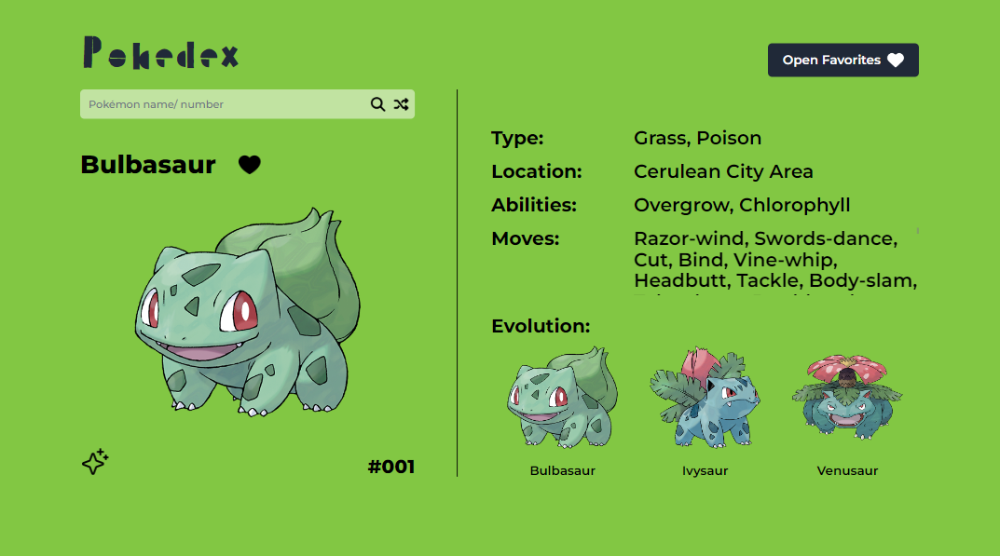
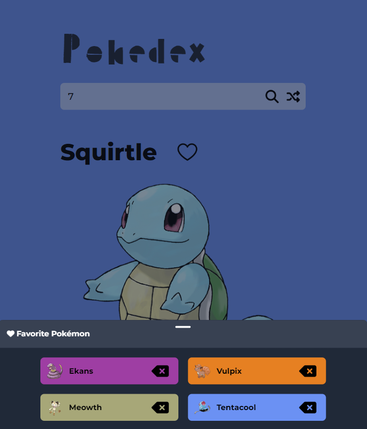

# Pokédex

**Name:** Elizabeth Trotter

**Project Scope:** Created a single page Pokémon application using [PokéAPI](https://pokeapi.co/). The design was Prototyped in Figma for (Desktop, Tablet, Mobile).

***Key Features:***

- Ability to get random Pokémon or search by name/ Pokédex number
- Inventory contains Gen 1 - 5 Pokémon and images contain both default & shiny forms
- Info provided for each Pokémon: Name, Element Typing, Location, All Abilities, All Moves, & Evolutionary Paths
- Ability to add to a Favorites list
- Fully Responsive with Tailwind CSS

## Website Preview

Figure 1: Pokedex in action on desktop

Figure 2: Tablet Pokedex in action

Figure 3: Viewing favorites list on mobile Pokedex

## Prototype

Click [Prototype](https://www.figma.com/proto/4JBQZiPG5JpQwJW4ZMutBj/Pokedex?type=design&node-id=1-2&t=M7vml5Ytx95oT6JE-1&scaling=contain&page-id=0%3A1&starting-point-node-id=1%3A2&show-proto-sidebar=1&mode=design) 
to visit the **Figma prototype design**.

---

## Peer Review
> **Name:** Adrian Martinez **Date / Time:** 2/1/24 2:50 PM
> 
> **Comment(s):**
> The site functions and runs as expected, the design and layout looks nice, and is generally responsive to all screen sizes. There were some issues, most visually, such as some text overlapping with each other when device width is small. Clicking on one of the evolution paths, there is no way to load up one of the forms selected, would be a nice quality of life addition to not have to search for it that way. Otherwise, it looks and runs great!

**Issues Resolved:**
- Confirmed responsiveness for mobile large :white_check_mark: *2/1/24 4:30 pm*
- Added additional feature / ability to click on evolution images to view data :white_check_mark: *2/2/24 9:00 pm*
